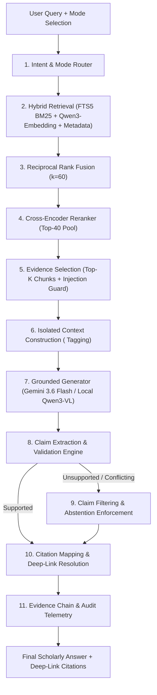

# PHASE 7 IMPLEMENTATION PLAN
## Ambedkar Heritage — Serious AI Research Assistant

**Phase**: 7 — Grounded RAG, Claim Validation, Multi-Mode Research, Citation Mapping  
**Date**: 2026-09-24  
**Status**: APPROVED FOR EXECUTION  
**Corpus**: 19 Archival Volumes (12,154 pages, 12,154 chunks indexed)  
**Search Foundation**: Phase 6 Four-Component Hybrid Search (FTS5 + Qwen3-Embedding + Metadata + Reranking)  

---

## 1. Objective

Build a serious, scholarly AI Research Assistant for the Ambedkar Heritage archive. **This is not a generic chatbot**. Every factual assertion must be directly grounded in retrieved archival chunks from Dr. B.R. Ambedkar's writings. Model training memory is strictly forbidden as historical evidence. If retrieved evidence is insufficient, the system must explicitly abstain.

---

## 2. Architecture & Pipeline



---

## 3. Research Assistant Modes (8 Distinct Workflows)

| Mode | Target Scope | Retrieval Strategy | Prompting Style & Purpose |
|:-----|:-------------|:-------------------|:--------------------------|
| **1. Ask** | General Archive | Hybrid top-5 | Direct factual and interpretive question answering. |
| **2. Explain** | Concepts & Doctrines | Hybrid top-6 | Pedagogical explanation of complex theories (e.g., social endosmosis, state socialism). |
| **3. Summarize** | Chapters & Debates | Hybrid top-6 or Volume filter | Distills core arguments, historical context, and key quotes. |
| **4. Compare** | Multi-Document | Split retrieval across 2+ targets | Structured comparative analysis highlighting doctrinal evolution across periods. |
| **5. Find Evidence** | Verbatim Quotes | High lexical + Semantic top-8 | Extraction-first: returns verified quotations with exact page & volume citations. |
| **6. Ask This Document** | Single Volume | Scoped to `object_id` | Restricts candidate pool exclusively to the specified book or speech collection. |
| **7. Ask This Page** | Single Page OCR | Scoped to `object_id` + `page_number` | Answers directly from the active viewer page without broader archive drift. |
| **8. Research Mode** | Deep Scholar Audit | Top-20 retrieved $\rightarrow$ Top-10 reranked | Exhaustive synthesis with complete claim audit, evidence chains, and confidence scores. |

---

## 4. Key Components & Implementation Tasks

### Task 1: Prompt Injection Defense & Data Isolation
- Archival text is strictly treated as untrusted historical **DATA**, never instructions.
- Data tagged with explicit delimiters:
  ```xml
  <ARCHIVAL_EVIDENCE id="CHUNK-1" document="AMBEDKAR-VOL-13" page="163">
  [Raw archival text]
  </ARCHIVAL_EVIDENCE>
  ```
- Pre-sanitization strips prompt injection payloads (`Ignore previous instructions`, `system prompt:`, `[INST]`, etc.).

### Task 2: Grounded Generator Service (`app/services/assistant/generator.py`)
- Dual-engine architecture:
  - **Cloud Primary**: `gemini-3.6-flash` via authenticated Google GenAI API.
  - **Local Fallback**: Local extractive synthesis and GPU inference.
- Temperature: 0.1 for high factual fidelity.
- Strict Abstention Clause:
  ```
  "The available archive does not contain sufficient evidence to answer this reliably."
  ```

### Task 3: Claim Extraction & Validation Engine (`app/services/assistant/claim_validator.py`)
- Deconstructs generated answers into atomic factual claims.
- Classifies each claim against evidence chunks:
  - `SUPPORTED`: Grounded in at least one retrieved chunk.
  - `PARTIAL`: Inferred or partially supported.
  - `UNSUPPORTED`: Not found in the provided evidence.
  - `CONFLICTING`: Directly contradicted by archival text.
- Unsupported claims are automatically redacted or qualified. If key claims lack support, the system triggers full abstention.

### Task 4: Citation Resolver & Deep-Linking (`app/services/assistant/citation.py`)
- Every citation maps to:
  - `document`: Archival Object ID (e.g., `AMBEDKAR-VOL-13`)
  - `title`: Canonical Title
  - `page`: Verified Page Number
  - `section`: Section title / header
  - `chunk_id`: Database Chunk UUID
  - `excerpt`: 1-2 sentence verbatim evidence excerpt
  - `viewer_url`: Deep-link into IIIF Document Viewer (`/documents/{id}/viewer?page={p}&query={q}`)

### Task 5: Evidence Chain & Audit Logging (`app/services/assistant/evidence_chain.py`)
- Retains full telemetry per response:
  - Query, Intent, Search Mode
  - Retrieved Candidates & BM25 / Vector scores
  - Reranker Cross-Encoder scores
  - Selected Evidence Chunks
  - Extracted Claims & Validation statuses
  - Model name & version
  - Response time and token count

### Task 6: API Routes (`app/api/v1/assistant.py`)
- `POST /api/v1/assistant/ask`: Unified multi-mode endpoint.
- `POST /api/v1/assistant/ask-page`: Scoped single-page query.
- `POST /api/v1/assistant/validate-claims`: Standalone claim verification.
- `GET /api/v1/assistant/history`: Evidence chain telemetry inspection.

### Task 7: Frontend Research Assistant UI (`frontend/app/assistant/page.tsx`)
- Mode selector (Ask, Explain, Summarize, Compare, Find Evidence, Research Mode).
- Scope selector (Entire Archive, Specific Volume, Active Page).
- Interactive Citation Badges: clicking opens Document Viewer at the exact page.
- Evidence Chain Drawer: inspect retrieved chunks, reranker scores, and claim validation audits.

### Task 8: Benchmark Evaluation & Baseline Report
- 25 curated test questions:
  - 5 Answerable Factual
  - 5 Answerable Conceptual
  - 5 Unanswerable (historical topics absent from archive)
  - 5 Adversarial (prompt injection & instruction subversion)
  - 5 Misleading / Presupposition Traps
- Metrics:
  - Groundedness Score (%)
  - Citation Correctness (%)
  - Citation Completeness (%)
  - Unsupported Claim Rate (%)
  - Abstention Accuracy (%)
- Generate: `RAG_BASELINE_REPORT.md`
- Generate: `PHASE_7_COMPLETION_REPORT.md`

---

## 5. Verification Plan

1. **Automated Unit & Integration Tests**:
   - `test_prompt_injection_isolation`: Asserts injection payloads inside archival text are never executed.
   - `test_claim_validation_taxonomy`: Verifies `SUPPORTED`, `UNSUPPORTED`, `CONFLICTING` classification.
   - `test_abstention_on_unanswerable`: Confirms exact abstention wording when no evidence is found.
   - `test_citation_deep_links`: Ensures citation URLs open the exact document and page.
   - `test_assistant_modes`: Validates Ask, Explain, Summarize, Compare, Ask This Page.
2. **Benchmark Execution**:
   - Run `evaluate_rag.py` across 25 queries.
   - Verify 0% hallucination on unanswerable and adversarial queries.
