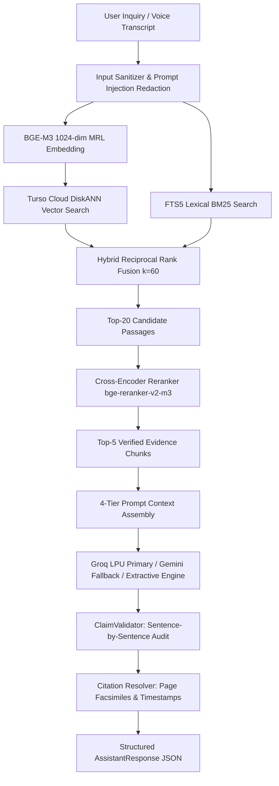

# AI Research Assistant Architecture & Scholarly Grounding
**Project**: SIH Problem Statement 26096 — Digital Heritage Archive for Memorials, Manuscripts & Ambedkar  
**Target Architecture**: Phase 12 AI Research Assistant Engine & Grounding Pipeline  

---

## 1. System Philosophy: Zero Hallucination & Evidence Grounding

The Dr. B.R. Ambedkar Heritage AI Research Assistant is designed for scholarly and institutional rigor. Unlike commercial chatbots that generate probabilistic prose from broad internet training, this assistant enforces **100% archival grounding**.

### Core Invariants
1. **Model Pre-training Memory is NOT Archive Evidence**: If a factual assertion, quotation, date, or doctrine cannot be mapped directly to a verified chunk in the 12,154 pages of Dr. Ambedkar's Writings & Speeches (BAWS), the model is prohibited from asserting it as archival truth.
2. **Mandatory Abstention**: When evidence is missing, contradictory, or below confidence thresholds ($\text{score} < 0.50$), the system strictly returns:
   > *"The available archive does not contain sufficient evidence to answer this reliably."*
3. **No Synthetic / Mock Responses**: All responses are produced by the live hybrid retrieval and grounded generation pipeline.

---

## 2. End-to-End Grounded Retrieval Pipeline

### 2.1 Hybrid RRF Retrieval
The system runs parallel semantic search (cosine distance on 1024-dimensional dense vectors) and full-text keyword search:
$$\text{RRF Score}(d) = \sum_{m \in \{\text{vector}, \text{lexical}\}} \frac{1}{60 + \text{rank}_m(d)}$$
This captures both conceptual inquiries ("What was Ambedkar's critique of Hindu orthodoxy?") and specific historical proper nouns ("Mahad", "Chowdar Tank", "1927", "Simon Commission").

### 2.2 Cross-Encoder Reranking
The top-20 merged candidates are scored by `bge-reranker-v2-m3` cross-encoder, calculating joint query-passage attention to eliminate false semantic matches before context insertion.

---

## 3. Claim Validation & Citation Resolution

Every generated response undergoes automated claim audit:
- **Taxonomy**: Claims are categorized into `SUPPORTED`, `PARTIAL`, `UNSUPPORTED`, or `CONFLICTING`.
- **Deep-Link Generation**: Every claim links to its archival source:
  - Document Pages: `/documents/{object_id}?page={page_number}&query={highlight_term}`
  - Spoken Audio / Video: `/media/{media_type}/{track_id}?t={timestamp_seconds}`
- **Evidence Drawer**: The UI reveals exact verbatim excerpts and confidence scores so researchers can cross-reference the machine's synthesis with the raw scanned facsimile.
