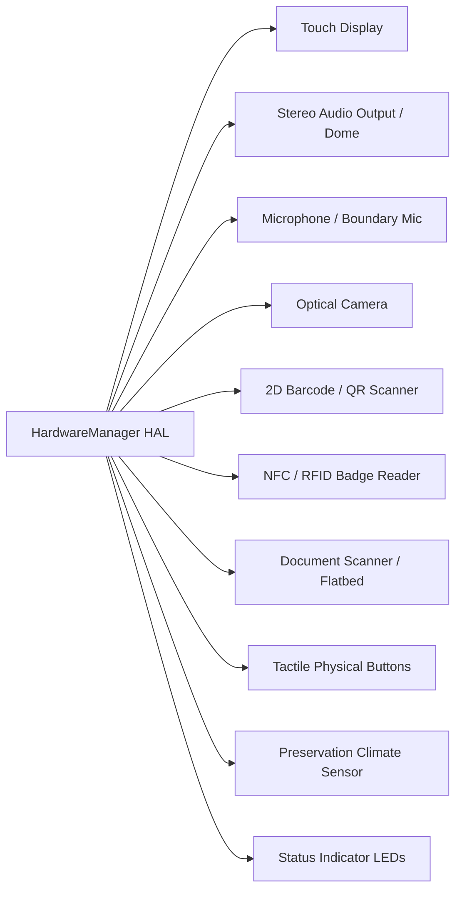

# Hardware Architecture & Abstraction Layer (HAL)
**Project**: SIH Problem Statement 26096 — Digital Heritage Archive for Memorials, Manuscripts & Ambedkar  
**Target Architecture**: Phase 12 Hardware Abstraction Layer & Peripherals  

---

## 1. System Philosophy: Safe Capability Detection

Museum kiosks and library workstations run in heterogeneous hardware environments. An exhibit station in a national memorial may possess a commercial multi-touch panel, thermal printer, and ESP32 environmental sensors, while an archivist laptop running evaluation or a field tablet uses generic onboard peripherals.

### Core Architectural Principle
> **"No Unhandled Hardware Crashes"**: The software platform must dynamically detect capabilities, gracefully degrade when peripherals are physically disconnected or unpowered, and fallback to simulation adapters without raising unhandled exceptions or breaking the visitor UI.

---

## 2. The 10 Archival Peripherals

The `HardwareManager` orchestrates 10 specialized peripheral devices across the system:

1. **Touch Display (`display`)**: 27-inch / 32-inch 4K capacitive touch interface (10-point multi-touch, palm rejection). In laptop/development mode, adapts to standard viewport mouse/touch events.
2. **Stereo Audio Output (`audio_output`)**: Dual-channel 48kHz audio DAC interfacing with directional ultrasonic acoustic domes to restrict speech playback to the immediate visitor perimeter.
3. **Microphone (`microphone`)**: USB boundary mic with hardware DSP noise reduction; provides audio streams to IndicConformer ASR.
4. **Optical Camera (`camera`)**: 1080p optical sensor for patron barcode scanning or QR-based session synchronization.
5. **QR Code Reader (`qr_reader`)**: Dedicated fixed-mount 2D imager or camera fallback for jumping to documents via mobile token.
6. **NFC / RFID Reader (`nfc_reader`)**: 13.56 MHz (ISO 14443A) reader for researcher cards and physical artifact exhibit tokens.
7. **Document Scanner (`document_scanner`)**: 600 DPI 24-bit color flatbed digitizer for patron manuscript contributions.
8. **Tactile Physical Buttons (`physical_buttons`)**: 4-button vandal-resistant arcade-grade buttons mapped to `[Home, Audio, Language, Help]`.
9. **Preservation Climate Monitor (`environmental_sensor`)**: ESP32-connected Sensirion SHT31, BH1750, and SCD30 monitoring vitrine micro-climates.
10. **Status Indicator LEDs (`status_indicator`)**: Tri-color physical indicator (Green=Optimal, Amber=Environmental Warning, Red=Hardware Fault/Tamper).

---

## 3. Deployment Profiles

The HAL activates one of 4 predefined deployment profiles via the `DEPLOYMENT_PROFILE` environment variable:

| Profile | Target Device | Mandatory Hardware | Optional / Fallback |
| :--- | :--- | :--- | :--- |
| `DEVELOPMENT` | Engineer Workstation | None (All peripherals simulated) | Software test mocks, synthetic ESP32 telemetry |
| `TABLET_DEMO` | iPad / Android Tablet | Touchscreen, WebAudio, WebMic | Camera QR scanning |
| `KIOSK` | Museum Gallery Kiosk | Touch Display, Directional Audio, Thermal Printer | NFC, Document Scanner, Tactile Buttons |
| `INSTITUTIONAL` | National Memorial Archive | All 10 Peripherals Active | Physical ESP32 vitrine telemetry, flatbed digitizer |

---

## 4. REST Telemetry Endpoints

- `GET /api/v1/hardware/profile`: Returns active profile, host OS, and capability matrix.
- `GET /api/v1/hardware/environment/current`: Returns live temperature, humidity, lux, CO2, and PREMIS 3.0 conservation evaluation.
- `GET /api/v1/hardware/diagnostics`: Probes Turso database latency, storage integrity, ML models, and peripheral buses.
