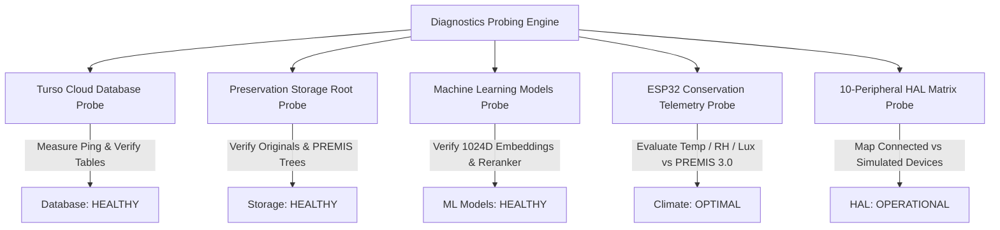

# Hardware Diagnostics & Subsystem Health Monitoring
**Project**: SIH Problem Statement 26096 — Digital Heritage Archive for Memorials, Manuscripts & Ambedkar  
**Target Architecture**: Phase 12 Hardware Diagnostics Portal & Telemetry Probing  

---

## 1. Overview of the Diagnostics Architecture

The administrative portal features a dedicated Hardware & Subsystem Diagnostics page located at:
`http://localhost:3000/admin/hardware` (API backend: `GET /api/v1/hardware/diagnostics`)

This console probes all underlying physical and digital infrastructure to ensure museum readiness before opening galleries to the public.

---

## 2. Subsystem Integrity Probes

### 2.1 Turso Cloud Database Probe
- Executes an active probe query (`SELECT count(*) FROM archival_objects`).
- Measures round-trip HTTP latency in milliseconds.
- Verifies integrity of critical schema tables (`archival_objects`, `document_chunks`, `entities`, `relationships`, `timeline_events`, `multilingual_works`).

### 2.2 Archival Storage Root Probe
- Inspects the physical storage directory structure (`storage/originals`, `storage/manifests`, `storage/premis`).
- Verifies read/write permissions and checks storage volume availability.

### 2.3 Machine Learning Models Probe
- Verifies dimensional consistency: confirms BGE-M3 outputs strictly 1024-dimensional Matryoshka representations.
- Probes the `bge-reranker-v2-m3` cross-encoder service to verify joint query-passage scoring capability.

### 2.4 Environmental Conservation Telemetry
- Receives live sensor readings from the physical or simulated ESP32 unit.
- Compares real-time values against PREMIS 3.0 museum conservation standards:
  - **Temperature**: 18.0°C – 22.0°C (Flags warning if outside 16.0–24.0°C; critical if >24°C).
  - **Relative Humidity**: 45.0% – 55.0% (Flags warning if outside 40.0–60.0%; critical mold alert if >60%).
  - **Ambient Light**: < 200 Lux (Flags photochemical fading alert if >200 Lux).
- Tracks data staleness: readings older than 120 seconds are automatically flagged as `STALE`.

---

## 3. HAL Peripheral Matrix (10 Peripherals)

The console provides a real-time capability matrix displaying:
- Device Identifier (e.g., `display`, `audio_output`, `microphone`, `camera`, `qr_reader`, `nfc_reader`, `document_scanner`, `physical_buttons`, `environmental_sensor`, `status_indicator`)
- Category, Bus / Interface, Requirement in active profile, and Status (`OPERATIONAL`, `SIMULATED`, `DEGRADED`, `UNAVAILABLE`).
