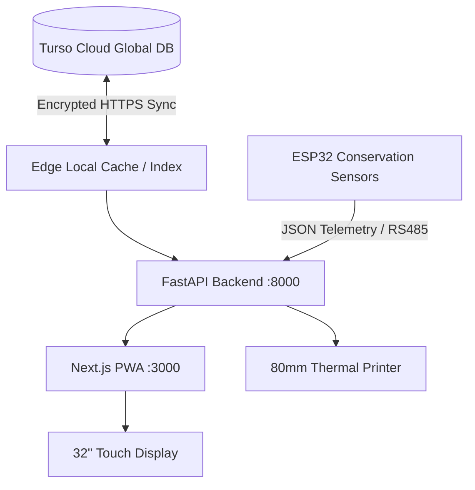

# Institutional Museum Kiosk Deployment Guide
**Project**: SIH Problem Statement 26096 — Digital Heritage Archive for Memorials, Manuscripts & Ambedkar  
**Target Architecture**: Phase 12 Museum Kiosk & Interactive Memorial Installation  
**Deployment Profiles**: `KIOSK`, `INSTITUTIONAL`, `TABLET_DEMO`, `DEVELOPMENT`

---

## 1. Executive Summary

This document governs the physical and operating system configuration for deploying the **Ambedkar Digital Heritage Archive** across institutional environments—specifically museum galleries, memorial centers (e.g., Chaitya Bhoomi, Deekshabhoomi, Dr. Ambedkar National Memorial 26 Alipur Road), university research libraries, and traveling heritage exhibits.

The system is engineered as an **offline-resilient, kiosk-mode Progressive Web Application (PWA)** combined with a local edge FastAPI service and a Hardware Abstraction Layer (HAL) interfacing with thermal printers, physical buttons, high-resolution document scanners, and ESP32 environmental preservation sensors.

---

## 2. Hardware Architecture & Bill of Materials

### 2.1 Recommended Institutional Kiosk Station
| Component | Specification | Deployment Role |
| :--- | :--- | :--- |
| **Main Compute Engine** | Intel NUC / Minisforum Mini PC (Core i5/i7, 16GB RAM, 512GB NVMe SSD, Fanless Aluminum Chassis) | Runs local edge caching backend, Next.js kiosk client, and local Turso synchronization |
| **Primary Display** | 32-inch or 43-inch 4K Commercial Touchscreen Display (10-Point Capacitive Multi-touch, Anti-glare Hardened Glass 7H, 500 nits) | Primary visitor interaction, IIIF facsimile browsing, timeline exploration |
| **Microphone Input** | Shure / Samson USB Boundary Microphone with hardware acoustic echo cancellation | High-clarity voice input for multilingual spoken search and assistant inquiries |
| **Audio Output** | Directed Sound Dome / Parabolic Ultrasonic Directional Speakers (or 3.5mm Headphone Jack) | Delivers localized audio narration (speech, historical speeches) without gallery noise bleed |
| **Thermal Receipt Printer** | 80mm ESC/POS Thermal Receipt Printer (USB / RS-232, 203 DPI, Auto-cutter) | Prints visitor study packets, citations, QR codes to jump to personal mobile devices |
| **Optical Scanner** | Fujitsu / Plustek Flatbed Archival Scanner (600/1200 DPI USB-TWAIN) | Curator digitizing station for visiting patrons to donate physical ephemera |
| **Barcode / QR Engine** | Honeywell / Datalogic Fixed-Mount 2D Imager | Rapidly scans ticket badges, catalog cards, and mobile session transfer tokens |
| **Microcontroller (Preservation)** | Espressif ESP32-WROOM-32D with Sensirion SHT31 & BH1750 | Environmental monitoring of physical artifact vitrines and display chambers |

---

## 3. Operating System Hardening (Windows / Linux)

### 3.1 Windows 11 Enterprise LTSC Assigned Access Mode
When deploying on Windows:
1. Create a dedicated non-administrator user account `kiosk-user`.
2. Configure **Windows Assigned Access (Single-App Kiosk Mode)** targeting Microsoft Edge:
   ```powershell
   # Launch Edge in full-screen locked kiosk mode pointing to the local kiosk route
   msedge.exe --kiosk http://localhost:3000/kiosk --edge-kiosk-type=fullscreen --no-first-run --disable-translate --disable-features=Translate
   ```
3. Disable all Windows hotkeys via Group Policy:
   - Disable `Ctrl + Alt + Del`, `Alt + Tab`, `Windows Key`, `F11`, `F12` DevTools.
   - Disable USB mass storage auto-run (prevent foreign flash drive execution).
   - Configure auto-login upon system startup.

### 3.2 Linux (Ubuntu Core / Debian) Cage / Wayland Kiosk
When deploying on Linux:
1. Use `cage` (a lightweight Wayland kiosk compositor):
   ```bash
   cage -- chromium-browser --kiosk --noerrdialogs --disable-infobars --check-for-update-interval=31536000 http://localhost:3000/kiosk
   ```
2. Enable `systemd` watchdog services to restart the browser and edge services automatically if memory exceeds 2.5 GB.

---

## 4. Network Profiles & Edge Resilience



1. **ONLINE STATE**: The edge server streams real-time vector queries and live cloud updates.
2. **DISCONNECTED STATE**:
   - The kiosk automatically detects network interruption within 250ms.
   - Exhibits, timeline events, high-resolution SVG documents, and heritage stories serve immediately from **IndexedDB / Service Worker Cache**.
   - Generative AI enters **Mandatory Abstention Mode** to prevent hallucinations when detached from verified vector bounds.

---

## 5. Maintenance & Telemetry Verification

- Run diagnostics by visiting `/admin/hardware` with an administrator token.
- Verify that temperature remains between **18.0°C and 22.0°C** and humidity between **45.0% and 55.0% RH**.
- Run daily fixity audit via `POST /api/v1/preservation/fixity-check/all`.
