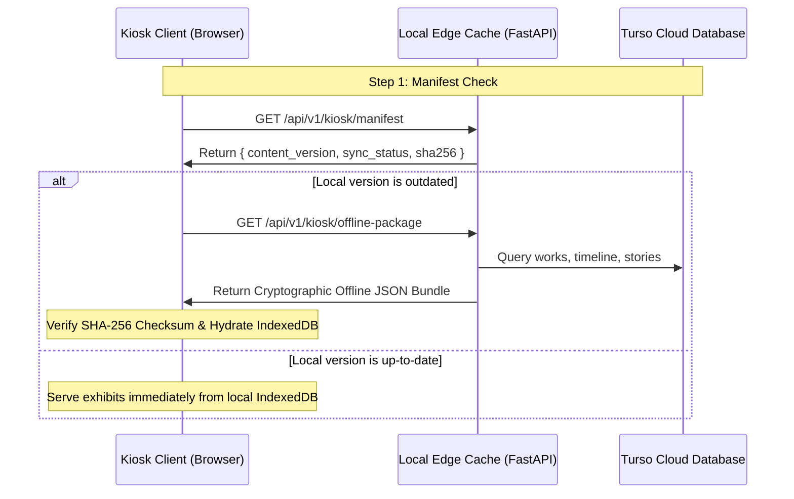

# Offline Mode Architecture & Synchronization Specification
**Project**: SIH Problem Statement 26096 — Digital Heritage Archive for Memorials, Manuscripts & Ambedkar  
**Target Architecture**: Phase 12 Disconnected Museum Operation & Offline Resilience  

---

## 1. Principles of Disconnected Operation

Institutional memorial sites and remote heritage exhibitions often face unstable or intermittent internet connectivity. The Ambedkar Heritage Archive is engineered so that **gallery visitors never face a blank error screen or broken navigation**.

### Core Tenet
> **"Preserve Archival Integrity in Disconnected Mode"**: While all verified documents, timeline milestones, multimedia metadata, and heritage exhibits remain 100% navigable offline, **generative AI must strictly abstain from generating ungrounded answers** when detached from the cloud vector store.

---

## 2. Synchronization Architecture



### 2.1 Sync Manifest (`GET /api/v1/kiosk/manifest`)
Returns lightweight version numbers and metadata hashes:
- `content_version`: e.g., `"2026.09.24-p12"`
- `metadata_version`: `"v1.2.0"`
- `sync_status`: `"SYNCHRONIZED"`
- `counts`: Canonical works and registered documents count
- `critical_offline_routes`: List of essential precached routes
- `offline_ai_policy`: `"MANDATORY_ABSTENTION_WHEN_DISCONNECTED"`

### 2.2 Offline Metadata Bundle (`GET /api/v1/kiosk/offline-package`)
Returns complete JSON payload with cryptographic verification:
```json
{
  "bundle_sha256": "543ddf5edb59c900a9b0725b70affdf42ca1146796680121afaeda705304ca02",
  "total_works": 8,
  "total_events": 15,
  "total_stories": 3,
  "data": { ... }
}
```
Before hydration, the kiosk client computes the SHA-256 hash of `data` to ensure zero transit corruption or tampering.

---

## 3. Mandatory Offline AI Abstention Policy

Under standard online operation, the AI Research Assistant connects to Turso Cloud DiskANN vector embeddings and hybrid RRF retrieval to ground every assertion.

When disconnected from the network:
1. The assistant client checks `navigator.onLine` and live connectivity probes.
2. Inquiries trigger **immediate and mandatory abstention**:
   > *"MANDATORY ABSTENTION (OFFLINE): The AI Research Assistant requires an active connection to Turso Cloud vector embeddings and the scholarly grounder. In accordance with institutional digital heritage preservation standards, generative AI is disabled during disconnected operation to prevent ungrounded hallucinations. Please browse cached catalog exhibits, timeline events, or reconnect to the network."*
3. The input field displays an offline lock state with an amber icon.
4. Hallucinated responses, ungrounded synthetic text, and probabilistic guessing are strictly barred by system invariants.

---

## 4. Critical Offline Routes & Cache Strategy

| Route | Content | Offline Storage Strategy |
| :--- | :--- | :--- |
| `/kiosk` | Museum touch exhibit dashboard | Pre-cached via Service Worker & IndexedDB |
| `/` | Archive homepage & catalog entry | Stored in Service Worker CacheStorage |
| `/documents` | Facsimile catalog and page browser | Metadata in IndexedDB; SVG pages cached on-demand |
| `/timeline` | 1891–1956 historical milestones | Preloaded in IndexedDB bundle |
| `/stories` | Curated heritage narratives | Full text and metadata preloaded in IndexedDB |
| `/media` | Audio-visual catalog and transcripts | Transcripts pre-cached; local media assets on disk |
| `/compare` | Dual-document comparative view | Pre-cached view templates and aligned texts |
