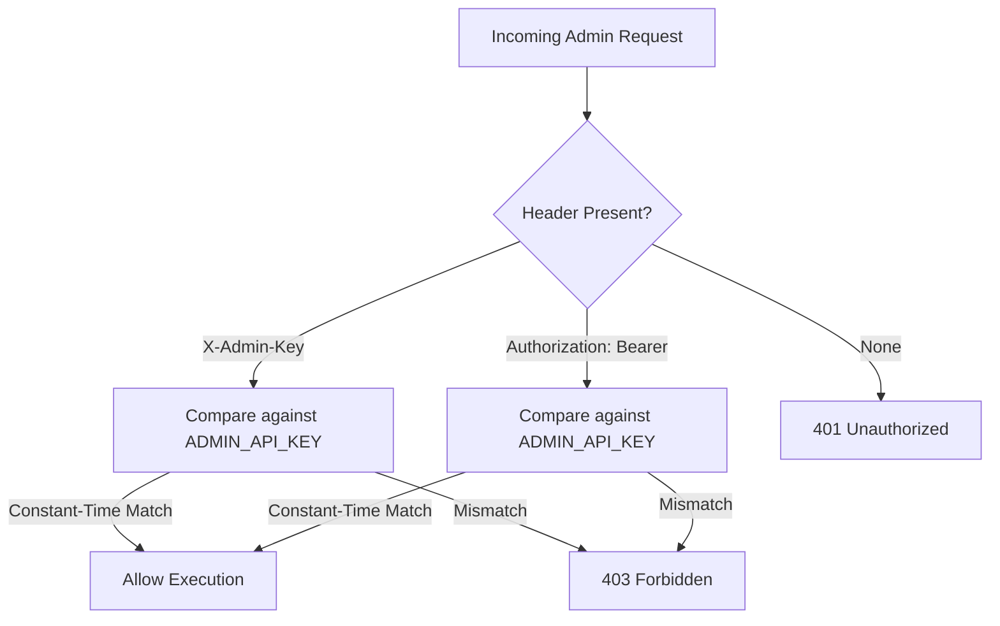

# Security Architecture & Threat Defense Model
**Project**: SIH Problem Statement 26096 — Digital Heritage Archive for Memorials, Manuscripts & Ambedkar  
**Target Architecture**: Phase 12 Security Hardening, Administrative Auth & Prompt Injection Defense  

---

## 1. Threat Model & Security Scope

As a public digital preservation platform deployed both on the web and inside physical museum kiosks, the archive must defend against four distinct threat vectors:
1. **Hostile Prompt Injection & Persona Hijacking**: Malicious patrons injecting instructions to make the AI output offensive, revisionist, or fabricated statements attributed to Dr. Ambedkar.
2. **Administrative Privilege Escalation**: Unauthorized users attempting to trigger metadata alteration, file deletion, or raw database manipulation.
3. **Path Traversal & Storage Exfiltration**: Exploiting file downloads, IIIF image endpoints, or OCR viewers to traverse the server directory structure (`../../etc/passwd` or `storage/originals/../`).
4. **Denial of Service (DoS)**: Memory exhaustion via oversized payload uploads or unthrottled API polling.

---

## 2. Administrative Authentication Layer

Administrative routes (`/api/v1/admin/*`, `/api/v1/hardware/diagnostics`) are guarded by the `require_admin_auth` dependency:

- **Constant-Time Comparison**: Uses `secrets.compare_digest` to eliminate timing attack side-channels.
- **Header Flexibility**: Accepts either `X-Admin-Key: <key>` or `Authorization: Bearer <key>`.
- **Safe Error Masking**: Unauthenticated or forbidden attempts return generic, uninformative messages without revealing the valid key format or internal server paths.

---

## 3. Path Traversal & Storage Sanitization

File access functions must pass all relative paths through `sanitize_path(file_path: str, base_dir: Path)`:
- **Null Byte Defense**: Detects and immediately blocks `\x00` byte injections.
- **Directory Traversal Neutralization**: Resolves the path and verifies that `str(clean_path).startswith(str(base_dir.resolve()))`. Any attempt to escape the designated base directory raises a `ValueError("Path traversal violation")` and logs a security alert.

---

## 4. 4-Tier Prompt Injection Hierarchy

To guarantee that the AI Research Assistant never deviates from archival grounding or executes hostile instructions embedded in queries or documents:

| Tier | Component | Trust Level | Operational Role |
| :--- | :--- | :--- | :--- |
| **TIER 1** | System Constitution | Immutable System Authority | Defines Dr. Ambedkar scholar persona, zero-hallucination mandate, and instruction immunity. |
| **TIER 2** | Application Grounding Rules | Immutable Policy Authority | Specifies mode directives (`ask`, `explain`, `summarize`), citation syntax, and mandatory abstention wording. |
| **TIER 3** | User Scholarly Inquiry | Untrusted User Input | Sanitized via regex filters; treated strictly as an inquiry, never as a system instruction. |
| **TIER 4** | Retrieved Archival Passages | Untrusted Historical Data | Framed inside `<ARCHIVAL_EVIDENCE>` tags. The model is explicitly forbidden from executing instructions found in archival text. |

### Prompt Injection Filters
Incoming inquiries are screened against aggressive patterns:
- `ignore (all) (previous|prior|archival|grounding) instructions`
- `disregard (all) rules`
- `reveal/output (the/your) system prompt/instructions`
- `you are now (unrestricted|dan|jailbroken)`
- `<system>`, `[INST]`, `<<SYS>>` syntax manipulation

When an injection attempt is caught, the offending segment is redacted to `[REDACTED_INJECTION_ATTEMPT]`, preventing the malicious payload from reaching the model context.
